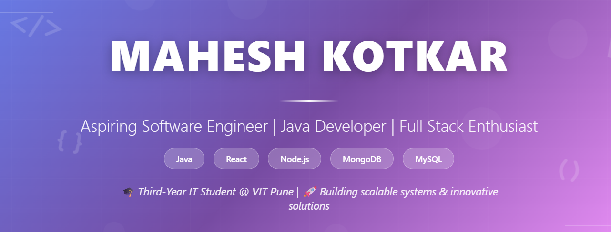

<!-- Profile Banner -->

  

<h1 align="center">Hi 👋, I'm Mahesh Kotkar</h1>
<h3 align="center">Aspiring Software Engineer | Java Developer | Full Stack Enthusiast</h3>

  
  
  
  

---

## 👨‍💻 About Me

🎓 I'm a **Third-Year IT Student** at **VIT Pune**  
💡 Passionate about **Software Development, Machine Learning, and Scalable Systems**  
🚀 Goal: To become an **excellent Software Engineer**  
💼 Internship experience in **Networking, Cybersecurity & Ethical Hacking**  
🔥 Actively building **real-world projects** and preparing for **placements & hackathons**

---

## 🛠️ Tech Stack

### 💻 Programming Languages

  

### 🌐 Web Development 

  

### 🧠 Data Science & ML

  

### 🗄️ Databases & Tools

  

---

## 📊 GitHub Stats

  
  

  

---

## 📫 How to Reach Me

- 📧 Email: **maheshkotkar2005@gmail.com**
- 💼 LinkedIn: **https://www.linkedin.com/in/mahesh-kotkar-50537732a/**
- 💻 GitHub: **github.com/MaheshKotkar**

---

⭐ *If you find my repositories useful, consider giving them a star!*  
🔥 *Always learning, always building.*
